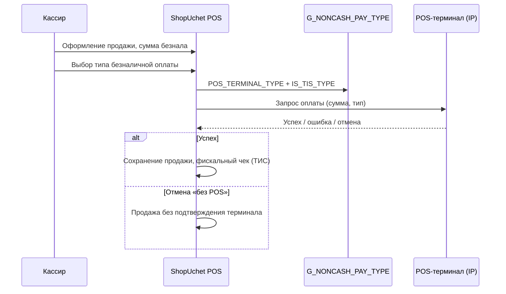

# ShopUchet — анализ интеграций Kaspi / Jusan / Halyk и применимость для CleverPos

Документ фиксирует **только анализ** (без изменений кода). Связанные материалы: [`KZ-RETAIL-WAREHOUSE-NKT-ANALYSIS.md`](KZ-RETAIL-WAREHOUSE-NKT-ANALYSIS.md), [`TODO.md`](../TODO.md).

**Дата:** 2025-06-08  
**Источник:** `shopuchet-master/` (Delphi + Firebird, UI-формы `.dfm`, проект `ShopUchet.dproj`)

---

## 1. Ограничения репозитория shopuchet-master

| Что есть | Чего нет |
|----------|----------|
| ~69 файлов `.pas` (утилиты, лицензия, часть форм) | Исходники **логики терминалов и фискализации** |
| Формы `.dfm` (настройки, продажа, справочники) | `frmPosTerminalProcess.pas`, `frmTerminalSetup.pas`, `frmSalePayment.pas` |
| Ссылки в `.dproj` на модули | `UnRekassa.pas`, `UnECWID.pas` и др. |
| SQL в `.dfm` (таблицы `KASPI_*`, процедуры `G_NONCASH_PAY_TYPE_*`) | Скомпилированные `.exe`/`.dll` в `shopuchet32/` (папка пуста) |

**Вывод:** ShopUchet можно использовать как **референс по UX, модели данных и точкам встраивания**, но **нельзя перенести код** — протоколы общения с терминалами и облачными кассами нужно реализовывать заново по официальной документации банков и ОФД.

---

## 2. Четыре разных направления интеграций (не путать)

В ShopUchet «Kaspi» встречается в **двух несвязанных смыслах**. Плюс отдельно — фискализация РК и интернет-магазины.

```
┌─────────────────────────────────────────────────────────────────────────┐
│  A. POS-терминал (эквайринг)     IP в ЛС → сумма с кассы → терминал     │
│     Kaspi terminal | Halyk terminal | Jusan terminal                    │
├─────────────────────────────────────────────────────────────────────────┤
│  B. Фискализация РК (ТИС/ОФД)   Webkassa | LightKassa | ReKassa        │
│     + классические ФР (Атол, Штрих-М) по COM                            │
├─────────────────────────────────────────────────────────────────────────┤
│  C. Типы безналичной оплаты ТИС  KASPI QR | HALYK QR (для чека в ОФД)   │
├─────────────────────────────────────────────────────────────────────────┤
│  D. Kaspi Магазин (маркетплейс)  выгрузка каталога, склады, заказы API  │
│     (отдельно: ECWID — интернет-магазин)                                │
└─────────────────────────────────────────────────────────────────────────┘
```

Для CleverPos это **четыре независимых фазы** с разными API, настройками и приоритетами.

---

## 3. A. Платёжные терминалы (Kaspi / Halyk / Jusan)

### 3.1. Настройка (форма `frmSetup.dfm`, вкладка «Платежный терминал»)

- Чекбокс **«Использовать терминал»** (`cbUsePosTerminal`).
- Таблица терминалов в памяти (`mdPosTerminal`):

| Поле | Назначение |
|------|------------|
| `ID` | Порядковый номер |
| `IP` | IP-адрес терминала в локальной сети |
| `TypeTerminal` | Числовой тип (lookup → имя) |
| `Name` | Отображаемое имя типа |

- Подсказка в UI: IP берётся из настроек самого терминала; тип безналичной оплаты выбирается в справочнике и **автоматически** направляет платёж на нужный терминал.

**Типы в настройках фискального блока** (`cbTerminal` рядом с Webkassa/LightKassa):

- Kaspi terminal  
- Halyk terminal  

**Типы в диалоге выбора терминала** (`frmTerminalSetup.dfm`):

- Kaspi terminal  
- Jusan terminal *(Jysan Bank → ребрендинг Jusan)*  

Halyk в `frmTerminalSetup` **нет** — только в общих настройках и в справочнике ТИС (QR).

### 3.2. Справочник типов безналичной оплаты (`G_NONCASH_PAY_TYPE`)

Формы: `frmGNonCashPayTypeList.dfm`, `frmGNonCashPayType.dfm`.

Процедуры Firebird: `G_NONCASH_PAY_TYPE_INS/UPD/GET/DEL`.

| Поле | Назначение |
|------|------------|
| `NAME` | Название («Карта Kaspi», «QR Halyk» и т.д.) |
| `IS_ACTIVE` | Активен |
| `POS_TERMINAL_TYPE` | Привязка к записи из `mdPosTerminal` (какой IP/бренд) |
| `IS_TIS_TYPE` | Привязка к типу оплаты для фискального чека (см. §4) |

На форме продажи (`frmProdazhaTovaraN.dfm`):

- `leNonCashPayType` — выбор типа безнала;
- поля `SUMM_CASH_`, `SUMM_NONCASH_` в процедурах сохранения продажи.

### 3.3. Процесс оплаты (`frmPosTerminalProcess.dfm`)

- Заголовок: **«Обработка платежа»**.
- `TRichEdit` — лог шагов (текст с терминала/драйвера).
- `TcxProgressBar` — прогресс.
- Кнопка отмены: **«Закрыть и продолжить без POS»** — продажа может завершиться без успешного терминала (ручной/резервный сценарий).

Логика вызова — в отсутствующем `frmPosTerminalProcess.pas` / `frmSalePayment.pas`. По UI: **синхронный или полусинхронный диалог** на время операции на терминале.

### 3.4. Предполагаемый поток (реконструкция)



### 3.5. Протокол

В открытых `.dfm`/`.pas` **нет HTTP-эндпоинтов, портов и форматов сообщений**. Типично для РК: терминалы Kaspi/Halyk/Jusan работают в локальной сети (часто **фиксированный IP**, иногда SDK от банка). Для реализации в CleverPos нужны:

- документация **Kaspi Pay / Smart POS** (для юрлиц с договором эквайринга);
- API/SDK **Halyk** и **Jusan** для POS-терминалов;
- тестовый терминал или эмулятор от банка.

---

## 4. B. Фискализация Казахстана (ТИС / ОФД)

### 4.1. Настройки (`frmSetup.dfm`, блок фискального регистратора)

Типы облачной кассы (выпадающий список):

| Вариант | Примечание |
|---------|------------|
| Не выбрано | — |
| Фиск. регистратор через драйвер **Атол** | COM-порт, скорость |
| Фиск. регистратор через драйвер **Штрих-М** | COM-порт |
| **Webkassa** (Казахстан) | порт, логин/пароль ТИС |
| **LightKassa** (Казахстан) | то же |
| **ReKassa** (Казахстан) | модуль `UnRekassa.pas` в проекте, исходника нет |

Дополнительно: выбор **Kaspi / Halyk terminal** для печати чека (связка фиск + терминал в одном блоке настроек).

Опции:

- Печать через принтер чеков;
- Печать через фискальный регистратор;
- Печать суммы бонусов в чеке.

### 4.2. Типы оплаты для ТИС (`dxMemDataTIS` в `dmMain.dfm`)

Зашитые в памяти типы (hex → строки):

| ID | NAME |
|----|------|
| 1 | `KASPI QR` (Kaspi банк. карт.) |
| 17 | `HALYK QR` |

Поле `IS_TIS_TYPE` в `G_NONCASH_PAY_TYPE` связывает способ оплаты на кассе с кодом, уходящим в **фискальный чек** (QR-оплаты Kaspi/Halyk).

### 4.3. Применимость для CleverPos

Сейчас CleverPos:

- печатает **термочеки** (`sys_configurationprinters`, шаблоны `.ticket`);
- **не интегрирован** с Webkassa / LightKassa / ReKassa;
- фискальная логика завязана на португальский контекст (`ISoftwareVendor`, SAFT и т.д.).

Для магазина в РК **фискализация через ОФД** — отдельный обязательный трек (юридически), **не заменяется** POS-терминалом.

---

## 5. D. Kaspi Магазин (маркетплейс)

Это **не** оплата картой на кассе, а **синхронизация каталога и заказов** с Kaspi.kz.

### 5.1. Документация в репозитории

`shopuchet-master/kaspi/Help.txt`:

- https://guide.kaspi.kz/partner/ru/shop/api/orders  
- https://kaspi.kz/mc/#/settings?activeTab=0  

### 5.2. Настройки выгрузки (`frmExportOperData.dfm`, вкладка «Kaspi магазин»)

- Чекбокс **«Выгружать в Kaspi магазин»**.
- **ID партнёра Kaspi** (`edtMerch`).
- **Идентификатор товара** для Kaspi (радиогруппа):
  - ID товара в ShopUchet;
  - артикул;
  - штрихкод.
- Таблица **`KASPI_POINT`**: маппинг складов ShopUchet (`G_TOCHKA`) ↔ город (`KASPI_CITY`) ↔ имя склада в Kaspi (`ADRESS`).
- Ссылка для Kaspi магазина (поле в UI).

### 5.3. Флаг на товаре

- `IS_KASPI_SHOP` в карточке товара (`frmPriceListUn.dfm`, `cbKaspiShop` — «Выгружать в Kaspi Магазин»).
- Глобальный режим: `IS_KASPI_SHOP_MODE` (процедуры в `dmMain.dfm`).

### 5.4. Триггер синхронизации

Параметр **`UPLOAD_TO_EXT_APP_`** передаётся во многие stored procedures (товар, продажа, приход, касса, категория и т.д.) — признак **«отправить изменение во внешнее приложение»** (Kaspi Shop, ECWID, облако ShopUchet).

### 5.5. Связь с НКТ (CleverPos Phase E)

| | Kaspi Магазин | Национальный каталог (НКТ) |
|--|---------------|----------------------------|
| Цель | Продажи на маркетплейсе | Гос. каталог товаров, GTIN |
| API | Kaspi Partner Shop API | nationalcatalog.kz |
| Идентификатор | merchant SKU / barcode / internal ID | GTIN, OKTRU |
| Для вашего магазина | Опционально (если продаёте на Kaspi) | Обязательно по бизнес-процессу |

Оба могут использовать **один и тот же штрихкод** (`fin_article.BarCode`), но интеграции **разные**.

---

## 6. ECWID (интернет-магазин)

Вкладка «Интернет-магазин» → **ECWID.com** (`frmExportOperData.dfm`, `UnECWID.pas` в проекте без исходника). Аналогичный паттерн: флаг выгрузки, ID магазина, `UPLOAD_TO_EXT_APP_`. Для офлайн-розницы **не приоритет**.

---

## 7. Текущее состояние CleverPos (точки расширения)

### 7.1. Способы оплаты

- Таблица `fin_configurationpaymentmethod` (токены `MONEY`, `CREDIT_CARD`, `VISA`, …).
- UI: `PaymentDialog.cs` — кнопки способов оплаты, полная/частичная оплата.
- **Нет** привязки к IP терминала, **нет** ожидания ответа эквайера.

### 7.2. Плагины

- `LogicPOS.Plugin` → `IPlugin`, `ISoftwareVendor` (фиск/вендор PT).
- `IStockManagementModule` — пример модульной интеграции через DLL в `plugins/`.
- **Нет** `IPaymentTerminalProvider` / `IFiscalKazakhstanProvider`.

### 7.3. Терминал кассы

- `pos_configurationplaceterminal` — место/терминал POS (логин кассира), **не** банковский терминал.

### 7.4. Рекомендуемая архитектура (концепт, без реализации)

```
fin_configurationpaymentmethod
    └── опционально: TerminalProviderId, RequiresTerminalConfirmation

sys_configuration (или отдельная таблица pos_payment_terminal)
    └── IP, Brand (Kaspi|Halyk|Jusan), Enabled, TerminalOid

IPaymentTerminalProvider : IPlugin
    └── Task<PaymentResult> ChargeAsync(amount, currency, reference)
    └── void Cancel()

IFiscalKzProvider : IPlugin   // отдельно от эквайринга
    └── RegisterSaleAsync(..., paymentTypeTisCode)

PaymentDialog / DocumentFinance
    └── если способ оплаты → ChargeAsync → затем фискализация → commit
```

Плагины по одному на банк (или один адаптер с фабрикой по `Brand`), конфиг в BackOffice, лог операций как в `PosTerminalProcessForm`.

---

## 8. Что можно «взять» из ShopUchet

| Идея | Переносимость |
|------|----------------|
| Справочник безнала + привязка к терминалу | ✅ Модель данных и UX |
| Список терминалов IP + тип | ✅ |
| Модальный диалог ожидания оплаты с логом | ✅ |
| Fallback «продолжить без POS» | ✅ (с осторожностью — риск расхождения с банком) |
| Разделение ТИС-типа оплаты и POS-терминала | ✅ Для связки с Webkassa |
| Маппинг складов для Kaspi Shop | ✅ Если понадобится маркетплейс |
| Исходный код протоколов | ❌ Нет в репозитории |
| Прямой перенос Delphi → C# | ❌ |

---

## 9. Приоритеты для CleverPos (предложение)

Относительно уже зафиксированных фаз в `TODO.md` (C — штрихкоды, D — CleverApp, E — НКТ):

| Фаза | Содержание | Блокирует «скан → оплата»? |
|------|------------|----------------------------|
| **I.1** | Облачная ОФД (Webkassa / LightKassa / ReKassa) | Юридически для РК — да; технически касса работает без неё |
| **I.2** | POS-терминалы Kaspi / Halyk / Jusan | Нет (можно принимать наличные / ручной безнал) |
| **I.3** | Kaspi Магазин (каталог + заказы) | Нет |
| **I.4** | ECWID / прочие маркетплейсы | Нет |

**Практический порядок:**

1. Завершить **Phase C** (BarCode, этикетки) — основа и для НКТ, и для Kaspi Shop.  
2. **Phase D** — стабильная касса + CleverApp.  
3. Параллельно или следом — **I.1** (фискализация РК), если магазин работает официально.  
4. **I.2** — когда есть договор эквайринга и тестовый терминал от банка.  
5. **E (НКТ)** и **I.3 (Kaspi Shop)** — по бизнес-необходимости; общий GTIN, разные API.

---

## 10. Открытые вопросы (нужны до разработки)

1. Какой **ОФД** планируется (Webkassa / LightKassa / ReKassa)? Есть ли уже кабинет и тестовая среда?  
2. Какой **банк-эквайер** и модель терминала (Kaspi Pay Smart POS, Halyk, Jusan)?  
3. Нужен ли **Kaspi Магазин** или только офлайн-розница?  
4. Должна ли касса **блокировать** завершение продажи без успешного ответа терминала (ShopUchet допускает «без POS»)?  
5. Один терминал на точку или несколько (как grid в ShopUchet)?

---

## 11. Ключевые файлы ShopUchet для справки

| Область | Путь |
|---------|------|
| Настройки терминалов + фиск | `ShopUchetIshodniki/Main/frmSetup.dfm` |
| Выбор терминала при оплате | `ShopUchetIshodniki/Kernel/frmTerminalSetup.dfm` |
| Диалог обработки платежа | `ShopUchetIshodniki/Kernel/frmPosTerminalProcess.dfm` |
| Справочник безнала | `ShopUchetIshodniki/Guides/frmGNonCashPayTypeList.dfm` |
| Продажа, тип безнала | `ShopUchetIshodniki/Kernel/frmProdazhaTovaraN.dfm` |
| Kaspi Shop выгрузка | `ShopUchetIshodniki/Kernel/frmExportOperData.dfm` |
| Флаг товара Kaspi | `ShopUchetIshodniki/Guides/frmPriceListUn.dfm` |
| Типы ТИС Kaspi/Halyk QR | `ShopUchetIshodniki/Shared/dmMain.dfm` → `dxMemDataTIS` |
| Ссылки API Kaspi | `kaspi/Help.txt` |
| Список модулей проекта | `ShopUchetIshodniki/Main/ShopUchet.dproj` |

---

*Изменения кода CleverPos по этому документу не вносились.*
